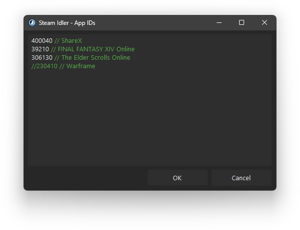

<h1 align="center">Steam Idler</h1>

Steam Idler is a lightweight tray application designed to help you idle Steam games or apps to gain playtime or collect trading cards. The app starts automatically with Windows and runs quietly in your system tray, providing a simple and effective way to idle games or apps without launching them manually.

<p align="center"></p>

## How to Configure Apps

- Double-click the tray icon or right-click the tray icon and select "Edit App IDs...".
- Enter the App IDs in the textbox.
- Press "OK" to save.

**Example:**

```
400040 // ShareX
39210 // FINAL FANTASY XIV Online
306130 // The Elder Scrolls Online
```

**Tip:**

You can use `//` to add comments.

## How to Find App IDs

- Visit the game's or app's Steam store page.
- The App ID is located in the URL.

**Example:**

https://store.steampowered.com/app/400040/ShareX/

The App ID for ShareX is **400040**.